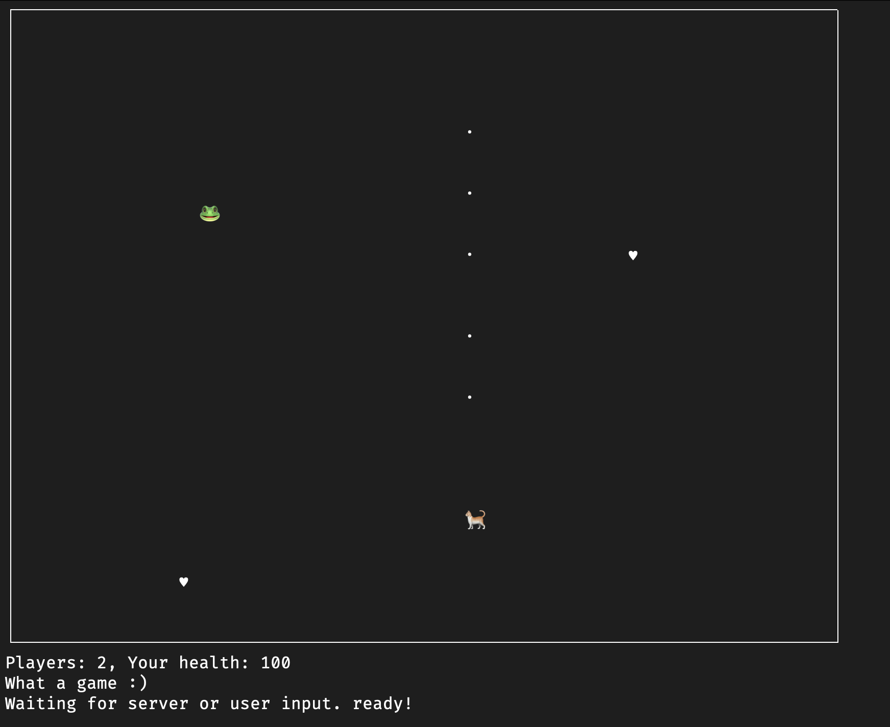

# CLI shooter game
This is a simple CLI shooter game written in Python. The game is played in the terminal and the players can move via
WASD keys and show with arrow keys.



## Running the game
To run the game, simply run the `server.py` file. The game will start and you can start playing.

each client should run the `client.py` file to connect to the server. Note to provide the server's IP address, the 
player name, and player avatar (must be a single character, can be an emoji) in the arguments. For example:

```
python3.12 client.py --player_name player1 --player_character 🐈
```

Once all players connect. Press Enter in the server terminal to start the game.